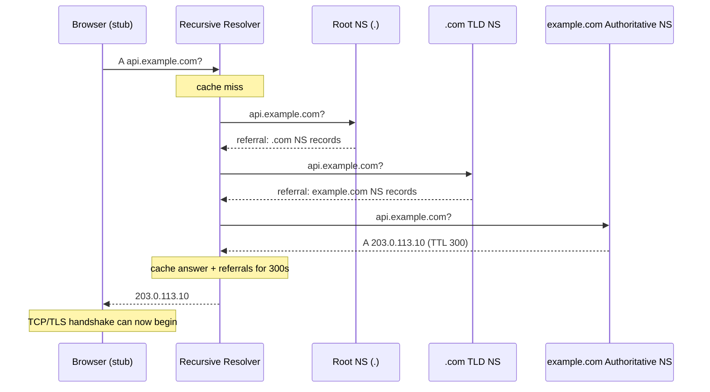

# DNS Architecture - Resolution, Caching, Load Balancing, and DNSSEC

[[00 - Index]]

> [!question] The Problem (Why This Exists)
> Every machine on a network is reached by a numeric IP address like `203.0.113.10`. But humans can't memorize hundreds of numbers, and worse — those numbers **change** whenever a machine moves to a new network or a service is scaled out to new servers. So we need a way to map memorable *names* to ever-changing *addresses*.
>
> In the early internet (ARPANET, 1970s–80s), this mapping lived in **one single text file** called `HOSTS.TXT`, maintained by one organization (the Stanford Research Institute). Every computer on the network downloaded a fresh copy over FTP, roughly once or twice a week. This broke down as the network grew:
> - **It didn't scale** — thousands of new machines meant the file was constantly out of date the moment you downloaded it.
> - **One point of failure and congestion** — every machine on the internet hammered a single server for updates.
> - **Name conflicts** — one central team had to approve every new name, and collisions were common.
> - **Stale data** — if a machine's IP changed, the rest of the world kept using the old address until their next download.
>
> The root cause: a **centralized, manually-distributed directory cannot keep up with a growing, changing network**. The fix, designed in 1983 (RFC 1034/1035), was to make the directory **distributed** (no single server holds everything), **hierarchical** (each organization manages its own slice), and **cached** (answers are reused for a limited time instead of re-fetching constantly). That system is DNS.

> [!abstract] TL;DR
> DNS is the internet's distributed "contacts list": it translates names like `api.example.com` into IP addresses. Lookups walk a hierarchy — root servers → top-level-domain servers → the domain's own authoritative servers — and every answer is cached at multiple layers for as long as its TTL allows. Because it sits in front of every connection your backend makes or receives, DNS is simultaneously a performance concern (resolution latency, caching), a reliability tool (health-checked failover, anycast), and a security surface (cache poisoning → DNSSEC). Node.js caches nothing by default, so production services need explicit DNS caching.

## 📖 Definition

**Plain-language analogy:** think of the contacts app on your phone. You never dial a raw number — you tap "Mom" and the phone looks up the number for you. If Mom changes her number, you update the contact once and keep tapping the same name. DNS is that contacts app for the entire internet: names for humans, numbers for machines, and a lookup layer in between so neither side has to care about the other's details.

**Formal definition:** the Domain Name System (DNS) is a globally distributed, hierarchical, eventually-consistent lookup service that maps human-readable names (`api.example.com`) to IP addresses and other resource records. The namespace is a tree of delegated zones — root → TLD (top-level domain, e.g. `.com`) → domain → subdomain — each served by independent **authoritative name servers** (the servers that hold the actual records for a zone and can answer definitively). Queries run primarily over UDP port 53 and are answered by a layered chain of caches (browser, OS stub resolver, recursive resolver), with TTLs controlling how long any answer may be reused.

## 🎯 Why It Matters

- **Every request starts with DNS.** Users resolve your API domain before the first TCP handshake (the connection-setup exchange between client and server that must complete before any data flows); your NestJS app resolves database hosts, Redis, and third-party APIs on every new connection. Resolution latency sits directly on the critical path.
- **DNS is your first load-balancing and failover layer.** AWS load balancers are just DNS names; multi-region routing, blue/green cutovers, and DR failover are all DNS operations. Your TTL (Time To Live — how long a resolver is allowed to cache an answer before asking again) choices determine how fast failover actually happens.
- **DNS outages are total outages.** If resolution fails, nothing else matters — the Dyn attack (2016) and the Facebook BGP/DNS incident (2021) took down huge parts of the internet despite healthy application servers.
- **Kubernetes service discovery *is* DNS.** `my-svc.my-namespace.svc.cluster.local` resolves via CoreDNS (the cluster's built-in DNS server); understanding TTLs, NDOTS (a resolver option controlling when a short name is treated as fully qualified — it causes surprising extra lookups inside Kubernetes), and record types explains real cluster behavior.
- **Node.js does not cache DNS by default.** A NestJS service making many outbound calls can hammer the resolver (and hit cloud DNS rate limits, e.g. the 1024 packets/sec per ENI — virtual network interface — limit in AWS) unless you add caching or connection reuse deliberately.
- **Security boundary.** Cache poisoning (tricking a resolver into storing a forged answer), hijacked registrar accounts, and lookalike domains are attack vectors; DNSSEC and DoT/DoH are the mitigations you should be able to reason about.

## 🧠 Core Concepts

### Namespace and hierarchy

- A fully qualified domain name (FQDN) reads right-to-left: `api.example.com.` = root (`.`) → `.com` TLD → `example.com` zone → `api` label. (A **zone** is the slice of the namespace that one team or server is responsible for.)
- The root is served by 13 *logical* root server identities (`a.root-servers.net` … `m.`), each backed by hundreds of **anycast** instances worldwide (many servers share one IP address; the network routes you to the closest one — explained further below).
- **Delegation**: a zone owner points NS records at authoritative servers; the parent zone stores those NS records, which is how resolvers walk down the tree.

### Recursive vs. iterative resolution

- The **stub resolver** — the tiny DNS client built into your OS (glibc `getaddrinfo`, the standard C function programs call to turn a name into an IP; or the Windows DNS client) — doesn't do the full lookup itself. It forwards everything to a **recursive resolver**, the "full-service" server run by your ISP (`8.8.8.8`, `1.1.1.1`, or your VPC's internal resolver — `169.254.169.253` on AWS) that does the legwork and caches results.
- The recursive resolver does the **iterative** work: ask a root server → get a **referral** (an answer meaning "I don't know, but ask these servers next") to `.com` TLD servers → ask TLD → get referral to `example.com` authoritative NS → ask authoritative → get the answer → cache and return it.
- One client query therefore fans out to ~3 authoritative queries on a cold cache; warm caches answer instantly.

### Record types you will actually use

| Record | Purpose | Gotcha |
|---|---|---|
| `A` / `AAAA` | Name → IPv4 / IPv6 | Multiple records = round-robin load balancing |
| `CNAME` | Alias to another name | **Illegal at the zone apex** (the bare domain `example.com` itself, as opposed to subdomains); use `ALIAS`/`ANAME` (Route53/Cloudflare-specific pseudo-records) for `example.com` → load balancer |
| `NS` | Delegates a zone/subdomain | Must point at names, not IPs |
| `SOA` | Zone metadata: serial, refresh/retry/expire, **negative-cache TTL** | Bump the serial or secondary servers never update |
| `MX` | Mail routing | Priority field; lower wins |
| `TXT` | Arbitrary strings — SPF (which mail servers may send for your domain), domain verification, ACME challenges (the Let's Encrypt certificate-issuance protocol) | Quoted, 255-char chunks |
| `SRV` | Host + port for a service | Real service discovery (MongoDB `mongodb+srv://`, XMPP, LDAP) |
| `PTR` | Reverse lookup (IP → name) | Lives in `in-addr.arpa`; mail servers check it |
| `CAA` | Which CAs may issue certs for this domain | Prevents mis-issuance |

### Caching and TTLs — the part that bites you

- **Every layer caches**: browser, OS stub, recursive resolver, and sometimes your application. A record's TTL is the budget shared by all of them.
- **TTL tradeoff**: low TTL (30–60s) = fast failover and cutovers, but more query volume, more latency, and more exposure to resolver abuse. High TTL (3600s+) = the opposite. Some resolvers clamp or ignore very low TTLs, so sub-30s failover is never guaranteed.
- **Negative caching**: `NXDOMAIN` ("this name does not exist") answers are cached too (duration = SOA `minimum` field). Creating a record right after querying it can appear "broken" until the negative entry expires — classic staging-environment confusion.
- **Lower TTLs *before* a planned migration**, wait one old-TTL period, make the change, verify, then raise them again.
- **Node.js specifics**: `dns.lookup()` goes through `getaddrinfo` on the libuv thread pool (libuv is the C library powering Node's event loop; its thread pool runs blocking-ish work off the main thread) and respects `/etc/hosts`. `dns.resolve*()` uses c-ares (a C library that talks to DNS servers directly, asynchronously). **Neither caches.** For high-call-rate NestJS services, attach `cacheable-lookup` to your HTTP agent (see the code walkthrough below) or use keep-alive agents (agents that reuse TCP/TLS connections instead of opening a new one per request) so connections — and their resolutions — are reused.

### DNS as a load balancer

- **Round-robin A records**: return several IPs; clients pick one. Simple, but no health awareness — a dead IP keeps getting traffic until the record is changed *and* caches expire.
- **Health-checked routing** (Route53, Cloudflare Load Balancing, NS1): DNS answers change based on endpoint health checks. Policies: **failover** (active/passive), **weighted** (gradual shifts, canary), **latency-based** (nearest AWS region), **geolocation/geoproximity** (data-residency routing).
- **Anycast**: the same IP announced from many locations; BGP (Border Gateway Protocol — the routing protocol that decides which paths internet traffic takes) routes each client to the closest location. This is how root servers, CDNs, and Cloudflare's `1.1.1.1` work — DNS answers are global, the network does the steering.
- **Split-horizon DNS**: different answers inside vs. outside your network — e.g., a Route53 *private hosted zone* makes `db.internal` resolve to private IPs only inside the VPC.

### Transport and DNSSEC

- **UDP 53** for normal queries; **TCP 53** for zone transfers (AXFR/IXFR — how secondary DNS servers copy the zone from the primary: full copy vs. incremental) and truncated responses. The classic 512-byte UDP limit is extended by **EDNS(0)** (an extension allowing larger UDP messages); a too-big response sets the TC bit ("truncated" flag) and the client retries over TCP.
- **Cache poisoning** (Kaminsky attack, 2008): forge a response before the real one arrives and a resolver caches your lie. Mitigations: source-port + query-ID randomization, 0x20 encoding, and ultimately **DNSSEC**.
- **DNSSEC** signs records — it provides **data-origin authentication and integrity, not encryption**. Chain of trust: the parent zone publishes a `DS` record (a hash of the child's public key — this is the "link" between parent and child); the child zone publishes `DNSKEY` (its public keys) and `RRSIG` (a cryptographic signature over each record set). A *validating resolver* (one that checks signatures and refuses forged answers) verifies the chain from the root down. Breaks if any link is missing or expired → the whole domain fails to resolve for validating resolvers (several real-world outages were expired RRSIGs).
- **DoT (port 853, TLS)** and **DoH (DNS over HTTPS, port 443)** encrypt the stub→resolver hop. Great for privacy on untrusted networks; controversial in enterprises because it bypasses network DNS controls and visibility.

## 💻 Example / Code Walkthrough

Full cold-cache resolution of `api.example.com`:



Weighted failover with health checks (Route53-style), as zone-file-ish pseudocode:

```text
api.example.com.  60  A  203.0.113.10   ; primary,   health-checked, failover=PRIMARY
api.example.com.  60  A  198.51.100.20  ; DR region, health-checked, failover=SECONDARY
```

When the primary health check fails, the authoritative server stops returning `203.0.113.10`; clients pick up the secondary after at most one TTL (60s) — plus however long stale resolvers actually hold it, which is why you don't rely on DNS alone for zero-downtime failover.

### Application-side DNS caching in NestJS

Node never caches DNS, so a service making hundreds of outbound calls per second re-resolves the same hostname constantly. Fix: one shared `https.Agent` whose lookups go through `cacheable-lookup`.

```bash
npm install cacheable-lookup @nestjs/axios
```

```ts
// dns-cache.module.ts
import { Global, Module } from '@nestjs/common';
import { HttpModule } from '@nestjs/axios';      // NestJS wrapper around axios
import CacheableLookup from 'cacheable-lookup';  // TTL-aware DNS cache
import https from 'node:https';

// 1. Create the cache. It stores answers and honors each record's TTL,
//    so entries expire and get re-resolved automatically.
const cacheable = new CacheableLookup();

// 2. Create ONE shared HTTPS agent for the whole app.
//    keepAlive reuses TCP/TLS connections, which is a second win on top
//    of DNS caching (fewer handshakes, fewer lookups).
const httpsAgent = new https.Agent({ keepAlive: true });

// 3. Redirect this agent's hostname lookups through our cache
//    instead of Node's default (uncached) dns.lookup().
cacheable.install(httpsAgent);

@Global() // makes HttpService injectable everywhere without re-importing
@Module({
  imports: [
    HttpModule.register({
      httpsAgent,   // every axios request in the app uses the cached agent
      timeout: 5_000,
    }),
  ],
  exports: [HttpModule],
})
export class DnsCacheModule {}
```

```ts
// billing.service.ts
import { HttpService } from '@nestjs/axios';
import { Injectable } from '@nestjs/common';
import { firstValueFrom } from 'rxjs'; // HttpService returns RxJS Observables

@Injectable()
export class BillingService {
  constructor(private readonly http: HttpService) {}

  async getInvoice(id: string) {
    // The first request resolves 'billing.internal' and caches the answer.
    // Every request after that (within the record's TTL) skips DNS entirely.
    const { data } = await firstValueFrom(
      this.http.get(`https://billing.internal/invoices/${id}`),
    );
    return data;
  }
}
```

**How to verify it works:** run the service, hit the endpoint in a loop, and inspect `cacheable.stats` (the instance exposes hit/miss counters) — or watch resolver query volume in your VPC metrics drop to ~zero for that hostname. If you see one DNS query per HTTP request, the agent isn't being reused.

> [!balance] Trade-offs 
> No DNS design decision is free. Every choice buys one property by selling another:
>
> - **Low TTLs (30–60s).** *Gain:* fast failover and quick cutovers. *Pay:* more query load on resolvers and your (often metered) authoritative DNS provider, added first-hit latency, and no guarantee — many resolvers clamp or ignore very low TTLs anyway.
> - **High TTLs (hours).** *Gain:* fast resolution (almost always cache hits), resilience (cached answers keep working even if your authoritative servers are down), lower cost. *Pay:* slow failover and stale data for hours after any change you forgot to prepare for.
> - **DNS-based load balancing.** *Gain:* zero extra infrastructure, global reach, health-checked failover between regions. *Pay:* coarse control — no connection awareness, uneven client distribution, and client caches you don't own decide when traffic actually shifts. A dedicated L4/L7 load balancer gives precise, instant steering but is another component to run, pay for, and make highly available.
> - **Anycast.** *Gain:* nearest-location routing and automatic failover with no client changes — the network itself detours around a dead site. *Pay:* requires BGP control and your own IP space (in practice you rent it from Cloudflare/AWS/etc.), and troubleshooting "which location did I even hit?" is harder.
> - **DNSSEC.** *Gain:* resolvers can cryptographically reject forged answers — the real fix for cache poisoning. *Pay:* operational complexity — key rollover, signatures that expire (expired RRSIGs have caused full-domain outages), larger responses, and it still gives you **no** confidentiality.
> - **App-level caching (`cacheable-lookup`).** *Gain:* near-zero lookup latency and immunity to cloud DNS rate limits. *Pay:* one more moving part; if you cache errors or ignore TTLs, your app holds onto dead IPs longer than the internet did.
> - **DoT / DoH.** *Gain:* the stub→resolver hop is encrypted — no eavesdropping or tampering on coffee-shop Wi-Fi. *Pay:* enterprises lose DNS-level visibility and policy controls, and you shift trust from your ISP to a third-party resolver.

> [!warning] Common Pitfalls
> - **Assuming Node.js caches DNS.** It doesn't — neither `dns.lookup()` nor `dns.resolve*()`. Under load this means thousands of redundant queries, added latency, and tripped cloud rate limits (AWS: 1024 pps per ENI). Add `cacheable-lookup` or keep-alive agents.
> - **"I created the record but it doesn't resolve!"** You probably queried the name *before* creating it, and the `NXDOMAIN` got cached (negative caching). Wait for the SOA negative TTL to expire, or test from a resolver that never saw the query.
> - **Lowering the TTL at migration time.** By then it's too late — the old answer is already cached under the old TTL. Lower it *one full old-TTL period before* the change.
> - **Expecting instant DNS failover.** Health-checked records only help after every cache between you and the client expires — and some resolvers clamp low TTLs. DNS failover is minutes-scale, not seconds-scale; use a load balancer for fast cutover.
> - **CNAME at the apex.** `example.com` cannot be a CNAME (it would clash with the required SOA/NS records). Use your provider's `ALIAS`/`ANAME` feature instead.
> - **Believing in "DNS propagation."** There is no propagation — only caches expiring at different times. `dig` against *your* resolver proves nothing about what other resolvers worldwide still hold.
> - **Kubernetes ndots surprises.** With the default `ndots:5`, a query for `api.example.com` is first tried against the cluster's search domains (`api.example.com.default.svc.cluster.local` …), producing extra NXDOMAIN round-trips. Use a trailing dot (`api.example.com.`) or tune `dnsConfig` for latency-sensitive services.

> [!todo] Prerequisites
> - **What an IP address and a port are**, and the basic client–server model (a client opens a connection, a server answers).
> - **Rough shape of an HTTP request** — you should know that "calling an API" means opening a connection and exchanging messages, so DNS's place *before* that connection makes sense.
> - Helpful companions in this vault (not strictly required first):
>   - [[How the Internet and Browsers Work Under the Hood]] — the URL-to-render pipeline where DNS is step one.
>   - [[TCP-IP vs OSI Model and Network Packet Routing]] — the layers DNS rides on top of.
> - For the code walkthrough: basic NestJS dependency injection — see [[Dependency Injection (DI) and Inversion of Control (IoC) Patterns]].

## 🔗 Related Topics

- [[How the Internet and Browsers Work Under the Hood]] — DNS resolution is step one of the URL-to-render pipeline this topic walks through.
- [[TCP-IP vs OSI Model and Network Packet Routing]] — DNS is an L7 protocol riding UDP; anycast steering is a routing (BGP) trick, not a DNS one.
- [[Kubernetes Architecture - Pods, Services, Ingress, and Helm Charts]] — CoreDNS and the `svc.namespace.svc.cluster.local` naming scheme are in-cluster DNS.
- [[Service Discovery, API Gateways, and Service Mesh Networks]] — DNS-based discovery (A/SRV) vs. client-side and server-side discovery; meshes replace DNS lookups with sidecar routing tables.
- [[Multi-Region and Global Architecture - Data Residency, Latency, and Failover]] — latency-based and geolocation routing, health-checked failover, and the TTL math behind RTO.
- [[File Storage and CDN Architecture - Object Storage, Signed URLs, and Edge Caching]] — pointing your domain at a CDN is a CNAME/ALIAS decision with the same apex and TTL constraints.

## 📚 References

- RFC 1034 / RFC 1035 — the original DNS specification (concepts & implementation); still the ground truth.
- RFC 4033–4035 — DNSSEC protocol and threat model.
- Cloudflare Learning Center: "What is DNS?", DNSSEC, and TTL guides — clear and production-oriented.
- AWS Route53 documentation — routing policies, health checks, private hosted zones, alias records.
- *DNS and BIND* (5th ed., Cricket Liu & Paul Albitz, O'Reilly) — the classic deep reference.
- Julia Evans, *Networking: ACK!* / DNS zines (wizardzines.com) — fast, accurate mental models.
- Node.js `dns` module docs + `cacheable-lookup` README — for the application-side caching story.
