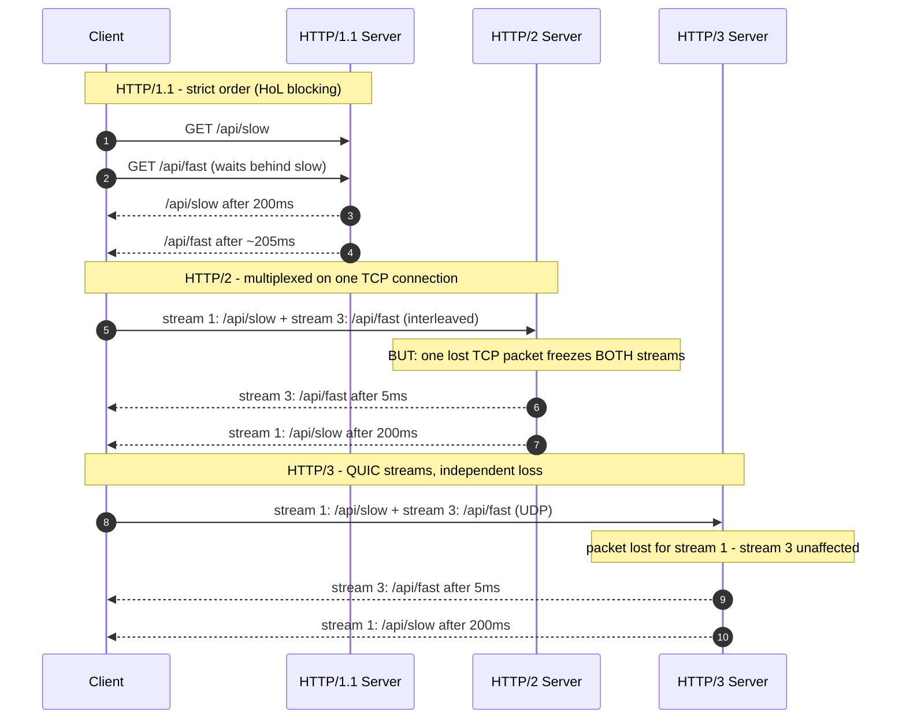

# HTTP-1.x, HTTP-2, and HTTP-3 (QUIC Protocol) Deep Dive

[[00 - Index]]

> [!question] The Problem (Why This Exists)
> In 1989, Tim Berners-Lee at CERN (the European physics research lab) had a concrete problem: researchers produced documents on dozens of incompatible computer systems, and there was no simple way to request a document from another machine and display it. His answer was three inventions that worked together: HTML (the document format), the URL (the address), and HTTP (the protocol to fetch the document). The first version, HTTP/0.9 (1991), was almost absurdly simple: open a connection, send `GET /page.html`, receive raw HTML, close. No headers, no images, no status codes.
>
> Each generation since then was invented to fix a specific performance wall the previous one hit:
>
> - **HTTP/1.0 → the connection-churn wall.** Once pages contained images and stylesheets, opening a brand-new TCP connection (Transmission Control Protocol — the internet's reliable, ordered delivery channel, which costs a multi-message "handshake" just to set up) for *every single file* made the web painfully slow. A 30-image page meant 30 connection setups.
> - **HTTP/1.1 (1997) → reuse, but one at a time.** Persistent connections (`keep-alive`) let one connection carry many requests. But requests on a connection must be answered **in strict order**: if request #1 takes 5 seconds on the server, requests #2–#30 wait behind it. This queue-jam is called **HTTP head-of-line blocking** (HoL blocking — one slow item at the front of a queue stalls everything behind it). Browsers worked around it by opening **6 parallel connections per domain**; developers added hacks like domain sharding (spreading files across `img1.example.com`, `img2.example.com` to get more connections). More connections = more server memory, more handshakes, more congestion.
> - **HTTP/2 (2015, based on Google's SPDY experiment) → many conversations on one connection.** It splits messages into binary **frames** tagged with a **stream ID**, so many requests and responses interleave over a **single** TCP connection (**multiplexing**). HTTP-level HoL blocking disappeared. But a deeper flaw surfaced: **TCP-level HoL blocking**. TCP promises the application one perfectly ordered byte stream, so if one network packet is lost (common on Wi-Fi/mobile), TCP freezes delivery of **everything** — all streams — until that packet is retransmitted. Twenty parallel requests, all stalled by one lost packet belonging to one of them.
> - **Root cause of the remaining pain:** TCP is a 1981 single-stream design; the modern web wants hundreds of independent streams. **HTTP/3 (standardized 2022)** therefore abandons TCP and runs over **QUIC** — a new transport built on UDP (User Datagram Protocol — the lightweight, unordered, connectionless sibling of TCP) that re-implements reliability **per stream**, so one lost packet stalls only the stream it belonged to.

> [!abstract] TL;DR
> HTTP/1.1 is text-based and serves one request at a time per connection — browsers compensate with 6 connections and developers with hacks. HTTP/2 is binary and multiplexes many streams over one TCP connection, with compressed headers — but a single lost TCP packet still freezes every stream (TCP head-of-line blocking). HTTP/3 replaces TCP with QUIC over UDP: independent loss recovery per stream, faster encrypted handshakes (0-RTT for returning clients), and connections that survive network switches (Wi-Fi → cellular). In production, your NestJS app usually speaks HTTP/1.1 or HTTP/2 while a CDN or load balancer terminates HTTP/2/3 at the edge.

## 📖 Definition

**Plain-language analogy:** think of getting documents from a warehouse.
- **HTTP/1.0:** every document needs its own courier trip — drive to the warehouse, get one page, drive back, repeat.
- **HTTP/1.1:** one courier stays on the road and can fetch many documents per trip — but strictly in the order requested. If document #1 takes forever to find, #2–#30 sit waiting in the van.
- **HTTP/2:** one big truck carries many color-coded boxes (streams) at once and the receiver sorts them by color. But there's only one truck on one road: if the truck gets a flat tire (a lost TCP packet), **every** box stops moving.
- **HTTP/3:** a fleet of independent drones, one per document. If one drone is delayed, all the others keep flying.

**Formal definition:** HTTP (Hypertext Transfer Protocol) is the application-layer request/response protocol of the web. **HTTP/1.1** is its text-based form over persistent TCP connections with strictly ordered responses. **HTTP/2** keeps the same semantics (methods, status codes, headers) but adds a binary framing layer: messages become frames on numbered streams, multiplexed over one TCP connection, with HPACK header compression. **HTTP/3** keeps HTTP/2's semantics but runs over **QUIC**, a UDP-based transport that integrates the TLS 1.3 encryption handshake (TLS — Transport Layer Security — is what makes HTTPS secure), provides per-stream loss recovery, and identifies connections by a **Connection ID** instead of IP address + port.

## 🎯 Why It Matters

- **It decides how fast your API feels.** Connection reuse, header compression, and multiplexing are not browser trivia — they determine how many TCP/TLS setups your servers absorb and how much latency every client pays before your code even runs.
- **NestJS/Node defaults are HTTP/1.1.** HTTP/2 is available (Fastify adapter or Node's `http2` module); HTTP/3 is normally terminated at a CDN or load balancer (Cloudflare, AWS CloudFront/ALB, NGINX, Envoy) and translated to HTTP/1.1 or HTTP/2 before reaching your app. Knowing where each version is "born and dies" in your architecture is table stakes for backend work.
- **gRPC is built on HTTP/2.** If you do microservices with gRPC, its streaming features *are* HTTP/2 streams — you can't reason about gRPC without this topic.
- **Real-time features feel the version differences.** Under HTTP/1.1, browsers allow only 6 connections per domain, so a few open SSE (Server-Sent Events) streams can starve normal API calls; over HTTP/2, SSE streams share the multiplexed connection. Directly relevant when you stream LLM tokens.
- **Mobile clients benefit most from HTTP/3.** Lossy cellular networks trigger exactly the TCP stalls QUIC avoids, and QUIC's Connection ID lets a download survive switching from Wi-Fi to 5G. (Performance claims like "20–30% faster on lossy networks" are benchmark-dependent — verify current numbers before relying on them in production.)

## 🧠 Core Concepts

### Version comparison at a glance

| Feature | HTTP/1.1 | HTTP/2 | HTTP/3 |
|---|---|---|---|
| **Transport** | TCP | TCP | QUIC over UDP |
| **Wire format** | Plain text | Binary frames | Binary frames |
| **Requests per connection** | 1 at a time (in order) | Many, multiplexed | Many, multiplexed |
| **Head-of-line blocking** | At HTTP layer | Fixed at HTTP layer; still at TCP layer | Effectively eliminated (per-stream loss recovery) |
| **Header compression** | None — full headers every request | HPACK | QPACK |
| **Handshake cost (HTTPS)** | 2–3 RTTs (TCP, then TLS) | 2–3 RTTs (TCP, then TLS) | 1 RTT; 0-RTT for returning clients |
| **Survives client IP change** | No | No | Yes (Connection ID) |

*RTT = round-trip time — one full network trip from client to server and back. Handshake cost is measured in RTTs because each one is pure waiting time before data flows.*

### HTTP/1.x: text, order, and the 6-connection ceiling

- An HTTP/1.1 message is human-readable text: a request line (`GET /users HTTP/1.1`), headers (`Host: api.example.com`), a blank line, then an optional body. You can literally type a request into `telnet`. This debuggability is why it refuses to die.
- `Connection: keep-alive` (default in 1.1) reuses the TCP connection for the next request — no new handshake per file.
- **HTTP pipelining** (sending request #2 before #1's response arrived) was supposed to remove the ordering wait, but buggy proxies and slow-first-response jams made browsers disable it. The lesson stuck: fix ordering at the framing layer, not by hoping.
- Workarounds that shaped the old web: 6 connections per domain, domain sharding, image sprites (merging many icons into one image), JS/CSS bundling. **With HTTP/2+, most of these become unnecessary or harmful.**

### HTTP/2: binary framing and multiplexing

- The **binary framing layer** sits between HTTP semantics and TCP. A request becomes a `HEADERS` frame plus `DATA` frames; every frame carries a **stream ID**. Frames from different streams interleave freely on the wire; the receiver regroups them by ID.
- Result: one TCP connection per origin (per domain) instead of six. Fewer handshakes, less server memory, no queue-jam at the HTTP layer — a slow stream no longer blocks fast ones at the HTTP level.
- **HPACK** (header compression): connections keep a shared table of previously seen headers; repeat offenders like `user-agent` and long `cookie` headers become tiny index references instead of full strings. Headers are often kilobytes per request — this is a large real-world saving.
- **Server push** (server sends resources before asked) was HTTP/2's headline feature that **failed in practice** — it pushed bytes clients often already had cached, and Chrome removed support in 2022 (verify current browser support before relying on anything related to push). Don't build on it.
- **The remaining flaw — TCP HoL blocking:** TCP knows nothing about streams; it delivers one ordered byte sequence. Packet #4 lost? Packets #5, #6, #7 wait in the OS buffer even if they belong to *other* streams. On clean datacenter networks this barely matters; on a phone in an elevator it dominates.

### HTTP/3 and QUIC: rebuild the transport

- **QUIC** moves reliability, ordering, and congestion control from the OS kernel's TCP into a userspace library over UDP — and scopes them **per stream**. Lost packet for stream 1? Only stream 1 waits; streams 2 and 3 deliver immediately.
- **Encryption is built in, not bolted on:** QUIC always runs TLS 1.3 and encrypts most of its own metadata (packet numbers included). The transport + crypto handshake completes in **1 RTT**, and returning clients can send data in the very first flight (**0-RTT** — zero round trips) by reusing cached session parameters. (0-RTT data can be replayed by an attacker who copies it — servers must only allow it for safe, idempotent requests like GETs.)
- **QPACK** replaces HPACK: HPACK's shared table assumed in-order delivery (fine over one ordered TCP stream, a HoL hazard in QUIC). QPACK allows out-of-order decoding with bounded blocking.
- **Connection migration:** TCP defines a connection as (client IP, client port, server IP, server port) — change your IP (Wi-Fi → cellular) and everything breaks. QUIC tags packets with a **Connection ID**, so the session survives IP changes mid-download.
- **Discovery and fallback:** servers advertise HTTP/3 via the `Alt-Svc` response header (and HTTPS-type DNS records), e.g. `Alt-Svc: h3=":443"; ma=86400` — "HTTP/3 lives on UDP port 443; remember this for a day." If UDP is blocked (corporate firewalls sometimes block UDP/443), clients silently fall back to HTTP/2.
- **ALPN** (Application-Layer Protocol Negotiation): the TLS handshake field where client and server agree on `h2` vs `http/1.1` (or `h3` in QUIC) — this is *how* a browser knows which version it's speaking before any HTTP bytes flow.

## 💻 Example / Code Walkthrough

The three generations handling the same two requests — one slow (`/api/slow`), one fast (`/api/fast`):



### NestJS speaking HTTP/2 (Fastify adapter)

Node's default `http` server is HTTP/1.1. Swapping NestJS to the Fastify adapter turns on real HTTP/2 with zero controller changes. Browsers only accept HTTP/2 over TLS (negotiated via ALPN), so we need a local certificate — `mkcert` makes one in seconds (`choco install mkcert`, then `mkcert -install` and `mkcert localhost`).

```bash
npm install @nestjs/platform-fastify
```

```ts
// main.ts
import { NestFactory } from '@nestjs/core';
import {
  FastifyAdapter,
  NestFastifyApplication,
} from '@nestjs/platform-fastify';
import { readFileSync } from 'node:fs';
import { AppModule } from './app.module';

async function bootstrap() {
  const app = await NestFactory.create<NestFastifyApplication>(
    AppModule,
    new FastifyAdapter({
      http2: true, // turn on Node's HTTP/2 engine inside Fastify
      https: {
        // browsers only negotiate h2 over TLS, so certs are required
        key: readFileSync('./localhost-key.pem'),
        cert: readFileSync('./localhost.pem'),
      },
    }),
  );
  await app.listen(3000);
}
bootstrap();
```

```ts
// app.controller.ts
import { Controller, Get, Req } from '@nestjs/common';
import type { FastifyRequest } from 'fastify';

@Controller('api')
export class AppController {
  @Get('version')
  getVersion(@Req() req: FastifyRequest) {
    // req.raw is the underlying Node request; httpVersion tells the truth:
    // '1.1' if a client fell back, '2.0' when multiplexing is active.
    return { protocol: req.raw.httpVersion };
  }
}
```

**How to verify it works:**

```bash
curl -sk --http2 https://localhost:3000/api/version
# -> {"protocol":"2.0"}
```

- `curl -I --http2 -k https://localhost:3000/api/version` should print `HTTP/2 200` as the status line. (Check `curl -V` first — your curl build must list `HTTP2`.)
- Chrome DevTools → Network tab → enable the **Protocol** column: you should see `h2`. On a site behind Cloudflare you may see `h3` there — that's HTTP/3 terminated at the CDN edge while your origin keeps speaking HTTP/1.1 or h2.

> [!balance] Trade-offs (المكسب والخسارة)
> - **HTTP/1.1.** *Gain:* dead simple, human-readable (debug with `telnet`/logs), universally supported by every tool and proxy ever made. *Pay:* one in-flight request per connection, full text headers on every request, and browsers compensating with 6 connections' worth of handshakes and server memory.
> - **HTTP/2.** *Gain:* one connection per origin (fewer TLS handshakes, less memory), no HTTP-level ordering jams, HPACK shrinks repetitive headers, foundation for gRPC. *Pay:* binary format you can't eyeball without tooling; TCP HoL blocking means **lossy networks can make h2 slower than well-tuned h1**; more complex server state (stream tables, flow control) per connection.
> - **HTTP/3 / QUIC.** *Gain:* per-stream loss isolation, 1-RTT/0-RTT encrypted setup, sessions that survive Wi-Fi ↔ cellular switches, more of the metadata encrypted. *Pay:* historically higher server CPU (userspace transport with less NIC offload than TCP — the gap is narrowing; verify current benchmarks before relying on this in production); UDP/443 is blocked or throttled by some networks so h2 fallback must always exist; 0-RTT is replayable (never allow it for non-idempotent requests); less mature middlebox/firewall visibility for ops teams.
> - **Terminating h2/h3 at a CDN/LB instead of your NestJS app.** *Gain:* your origin stays simple HTTP/1.1; the edge handles cert management, ALPN, and QUIC; clients get the performance wins close to them. *Pay:* you lose end-to-end h2 features (e.g. streams don't reach your app), and the hop from edge to origin becomes a separate connection you must tune.
> - **Long keep-alive timeouts.** *Gain:* fewer handshakes, less latency for repeat callers. *Pay:* every idle connection holds server memory — and mismatched timeouts between your load balancer and Node cause real outages (see Pitfalls).

> [!warning] Common Pitfalls
> - **Node `keepAliveTimeout` shorter than the load balancer's idle timeout.** Classic production bug: the LB (e.g. AWS ALB, 60s default) thinks a connection is still open, but Node (default 5s in older versions) already closed it → the LB sends a request into a closing socket → intermittent **502s** under low traffic. Rule: server's `keepAliveTimeout` must be *higher* than the LB's idle timeout (and `headersTimeout` higher still). Verify current defaults for your Node/ALB versions.
> - **Trying to use HTTP/2 in a browser without TLS.** Plain-text h2 (`h2c`) exists in the spec, but **no major browser supports it** — browsers only negotiate `h2` over HTTPS via ALPN. `h2c` is only for backend-to-backend links (e.g. some gRPC setups).
> - **Keeping HTTP/1.1-era optimizations on HTTP/2.** Domain sharding forces extra connections; heavy bundling wastes cache granularity. On h2/h3, prefer one domain and smaller, cacheable files.
> - **Expecting server push to work.** It was removed from Chrome in 2022 and is effectively dead — verify current browser support, but treat push as unavailable; use `103 Early Hints` or normal preload links instead.
> - **Assuming HTTP/3 removes the need for HTTP/2.** UDP/443 is blocked in plenty of corporate networks; h3 is always an *upgrade offer* (`Alt-Svc`), never the only option. Disable h2 and those clients lose connectivity.
> - **Blaming HTTP for application slowness.** Multiplexing fixes *transport* waiting. A slow SQL query or a blocked Node event loop is just as slow over HTTP/3.
> - **Testing with a curl that lacks support.** `curl --http2` / `--http3` fail confusingly on builds without those features — check `curl -V` first.

> [!todo] Prerequisites
> - **Hard prerequisites:**
>   - Client-server basics: a client opens a connection, sends a request, the server answers.
>   - A rough idea of TCP (reliable, ordered) vs UDP (fast, unordered) — one paragraph is enough.
>   - Basic NestJS project setup for the code walkthrough.
> - **Optional companion reading:**
>   - [[How the Internet and Browsers Work Under the Hood]] — where HTTP fits in the URL-to-render pipeline.
>   - [[TCP-IP vs OSI Model and Network Packet Routing]] — the transport layers HTTP stands on.
>   - [[DNS Architecture - Resolution, Caching, Load Balancing, and DNSSEC]] — what happens immediately before the TCP/QUIC handshake.

## 🔗 Related Topics

- [[How the Internet and Browsers Work Under the Hood]] — the full browser pipeline that issues these HTTP requests.
- [[TCP-IP vs OSI Model and Network Packet Routing]] — TCP's ordering guarantee is the root of HTTP/2's remaining flaw.
- [[DNS Architecture - Resolution, Caching, Load Balancing, and DNSSEC]] — HTTPS DNS records are one way clients discover HTTP/3 support.
- [[WebSockets vs Server-Sent Events (SSE) - Architecture and Use Cases]] — the 6-connection limit vs multiplexed streams directly shapes real-time design.
- [[Streaming LLM Tokens via Server-Sent Events (SSE) and Reactive Handling]] — token streaming behaves very differently on HTTP/1.1 vs h2/h3.
- [[gRPC and Protocol Buffers vs GraphQL Schema-First Architecture]] — gRPC's streaming is HTTP/2 streams.
- [[File Storage and CDN Architecture - Object Storage, Signed URLs, and Edge Caching]] — CDNs are where HTTP/3 is usually terminated in practice.

## 📚 References

- RFC 9110 (HTTP semantics), RFC 9112 (HTTP/1.1), RFC 9113 (HTTP/2), RFC 9114 (HTTP/3), RFC 9000 (QUIC) — the current standards.
- RFC 7541 (HPACK) and RFC 9204 (QPACK) — header compression.
- *HTTP/2 in Action* (Barry Pollard) and *HTTP/3 Explained* (Daniel Stenberg, free online).
- Cloudflare Learning Center — "What is HTTP/3?" and QUIC explainers.
- Node.js `http2` module docs and Fastify server options — for the implementation side.
- Smashing Magazine / web.dev HTTP/3 case studies — treat benchmark numbers as time-sensitive; verify current data before relying on them in production.
