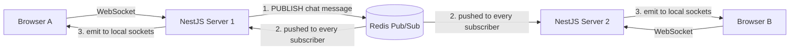

# Horizontal Scaling of WebSocket Servers using Redis Pub-Sub Adapters

[[00 - Index]]

> [!question] The Problem (Why This Exists)
> You build a chat feature with Socket.IO on **one** server. Every browser that connects keeps a permanent WebSocket connection open, and the server holds all those connections in its own memory. When someone sends a message, `server.emit('chat', msg)` simply loops over the connections in that one process and writes to each one. It works perfectly.
>
> Then traffic grows and you hit two walls:
> 1. **One machine has a ceiling.** Every WebSocket is an open TCP connection, and each one costs a file descriptor (an OS handle for an open connection) plus memory. A single Node.js process can hold tens of thousands of connections, but not millions (verify current limits before relying on specific numbers in production).
> 2. **The much nastier wall: adding a second server silently breaks delivery.** You put two servers behind a load balancer (a traffic distributor that spreads incoming connections across machines). Browser A's connection lands on Server 1; Browser B's lands on Server 2. Now A sends a chat message: Server 1 loops over **its** connections and sends it — but B's connection lives in Server 2's memory. Server 1 doesn't know B exists. B never receives the message. No error is thrown anywhere.
>
> **Root cause:** connection state is trapped inside each server's RAM, and the servers have no shared view of "who is connected where." **Solution:** give all servers a shared message bus. Redis Pub/Sub (a lightweight broadcast system built into Redis) becomes that bus: whenever any server wants to broadcast, it *publishes* the message to Redis; every server *subscribes* to Redis and forwards incoming messages to its own local connections. The Socket.IO Redis adapter wires this up automatically — your code doesn't change.

> [!abstract] TL;DR
> A WebSocket connection lives in the memory of the single server that accepted it, so broadcasting from one server can never reach clients of another server. The fix is Redis Pub/Sub as a shared bus: each server publishes outbound events to Redis and subscribes to events from every other server; `@socket.io/redis-adapter` plugs this into Socket.IO/NestJS so `server.emit()` works cluster-wide. You still need sticky sessions (or WebSocket-only transport) at the load balancer, and Pub/Sub is fire-and-forget — it never stores messages for offline users.

## 📖 Definition

**Plain-language analogy:** think of company offices with PA speakers (the loudspeakers used for announcements). A single office has one PA: you announce once, everyone hears it. When the company grows to five branch offices, each office has its own PA and its own people — an announcement made in office 1 reaches nobody in office 2. So the company installs one shared bulletin board at headquarters: every office posts its announcements there, and every office watches the board and reads new items out over its **local** PA. Redis is the bulletin board. Each WebSocket server is a branch office with its own PA. The people in each office are the connected browser tabs.

**Formal definition:** **Horizontal scaling** means handling more load by adding more server instances instead of upgrading one machine. **Redis Pub/Sub (Publish/Subscribe)** is Redis's built-in messaging feature: publishers send messages to named *channels*, and every subscriber currently listening on a channel receives a copy immediately — with no message storage. A **Redis Pub/Sub adapter** (such as `@socket.io/redis-adapter`) replaces Socket.IO's default in-memory broadcast logic: instead of writing only to its own sockets, each server publishes broadcasts to Redis and applies broadcasts received from Redis to its own local sockets.

## 🎯 Why It Matters

- **The #1 "works in dev, broken in prod" real-time bug.** Development runs one replica (one copy of your app); production runs several. Without the adapter, a random fraction of your users simply never receives messages — and nothing logs an error.
- **Real-time features can't scale past one box without it.** Chat, live notifications, collaborative editing, presence indicators, live dashboards — all of them break the moment you deploy a second instance.
- **Kubernetes makes this non-optional.** A deployment with `replicas: 3` behind a service *is* three separate processes with three separate memories. This topic is the difference between a demo and a production system.
- **Redis is usually already in your stack** for caching, so the coordination layer adds no new infrastructure to operate.
- **The pattern generalizes.** Any layer that holds stateful connections (WebSocket gateways, SSE fan-out, game servers) needs an external bus the moment you run more than one instance.

## 🧠 Core Concepts

### Why WebSockets scale differently from HTTP

- A normal HTTP request is **stateless**: each request is independent, so any server can answer any request. Load balancing HTTP is easy.
- A WebSocket is a **long-lived, stateful TCP connection** (it stays open for minutes or hours). It begins as an HTTP request with an `Upgrade` header (the client asking "can we switch protocols?"). After the upgrade, that connection is **pinned** to the exact process that accepted it — no other server can write to it.

### The fan-out problem

- `server.emit(...)` means: loop over the socket objects **in this process's memory** and write to each.
- Rooms (named groups of sockets, e.g. `order-42`) are also tracked per process.
- With N servers, each one sees roughly 1/N of all connected clients. Cluster-wide broadcast is impossible from memory alone.

### Publish/Subscribe as the shared bus

- A **channel** is just a named pipe, e.g. `socket.io#/#`. Publishing is **fire-and-forget**: if nobody is subscribed at that instant, the message is gone forever. There is no history and no replay. This single property drives most of the trade-offs below.
- Each server needs **two** Redis connections: one for publishing, and a dedicated one for subscribing. A Redis connection that enters "subscribe mode" cannot run normal commands — which is why the adapter duplicates the client.

### What the adapter actually does

- On `server.emit('chat', msg)`: the adapter serializes the packet (plus target room info) and publishes it to a Redis channel. **Every** node — including the sender — receives it, checks which **local** sockets match, and writes to them. This is why rooms keep working across the whole cluster with zero extra code.
- Emitting to one specific socket ID works too: the adapter routes a request over Redis to the node that owns that socket.

### Sticky sessions (session affinity)

- By default, Socket.IO clients start with **HTTP long-polling** (repeated HTTP requests that imitate a socket) and then upgrade to a real WebSocket. Those early HTTP requests **must all reach the same server**, so the load balancer must pin a client to one server. This pinning is called **sticky sessions** or *session affinity* (AWS ALB implements it with a cookie).
- Cleaner alternative: tell the client `transports: ['websocket']`. The client skips polling and opens the WebSocket directly, so **any** server can accept the single upgrade request — no stickiness required.

### Redis as a coordination point

- A single Redis instance is a single point of failure *for messaging* (existing sockets stay open, but cross-server delivery stops). Production setups use Redis Sentinel (automatic failover) or Redis Cluster.
- **Amplification:** every broadcast is delivered to **all** subscribed nodes, so Redis outbound traffic grows with your node count. Redis 7.0 added *sharded pub/sub* (`SSUBSCRIBE`), which spreads channels across cluster nodes; newer adapter versions support it (verify current adapter/Redis version support before relying on this in production).

## 💻 Example / Code Walkthrough

The message path when Browser A (connected to Server 1) sends a chat message that Browser B (connected to Server 2) must receive:



### Step 1: Install packages and start Redis

```bash
npm install @nestjs/websockets @nestjs/platform-socket.io socket.io @socket.io/redis-adapter redis
docker run -d -p 6379:6379 --name ws-redis redis:7
```

### Step 2: The Redis adapter (`redis-io.adapter.ts`)

```ts
import { IoAdapter } from '@nestjs/platform-socket.io'; // base WebSocket adapter
import { ServerOptions } from 'socket.io';
import { createAdapter } from '@socket.io/redis-adapter';
import { createClient } from 'redis';

// A custom adapter NestJS will use to build every Socket.IO server
export class RedisIoAdapter extends IoAdapter {
  private adapterConstructor: ReturnType<typeof createAdapter>;

  async connectToRedis(): Promise<void> {
    // Connection #1: used to PUBLISH every outgoing broadcast to Redis
    const pubClient = createClient({
      url: process.env.REDIS_URL ?? 'redis://localhost:6379',
    });
    // Connection #2: a dedicated SUBSCRIBER. Redis forbids normal commands
    // on a subscribed connection, so it must be a separate client.
    const subClient = pubClient.duplicate();

    // Both must be connected before we serve any traffic
    await Promise.all([pubClient.connect(), subClient.connect()]);

    // Build the Socket.IO adapter factory backed by these two clients
    this.adapterConstructor = createAdapter(pubClient, subClient);
  }

  createIOServer(port: number, options?: ServerOptions): any {
    const server = super.createIOServer(port, options); // standard Socket.IO server
    server.adapter(this.adapterConstructor);            // swap memory bus for Redis
    return server;
  }
}
```

### Step 3: Wire it into `main.ts`

```ts
import { NestFactory } from '@nestjs/core';
import { AppModule } from './app.module';
import { RedisIoAdapter } from './redis-io.adapter';

async function bootstrap() {
  const app = await NestFactory.create(AppModule);

  const redisIoAdapter = new RedisIoAdapter(app);
  await redisIoAdapter.connectToRedis();    // connect BEFORE accepting traffic
  app.useWebSocketAdapter(redisIoAdapter);  // every gateway now uses Redis

  // PORT comes from the environment so we can run several copies at once
  await app.listen(process.env.PORT ?? 3000);
}
bootstrap();
```

### Step 4: A minimal chat gateway (`chat.gateway.ts`)

```ts
import {
  WebSocketGateway,
  WebSocketServer,
  SubscribeMessage,
  MessageBody,
} from '@nestjs/websockets';
import { Server } from 'socket.io';

@WebSocketGateway({ cors: true }) // allow browser clients from any origin (dev only)
export class ChatGateway {
  @WebSocketServer()
  server: Server;

  @SubscribeMessage('chat')
  handleChat(@MessageBody() text: string) {
    // Thanks to the adapter, this ONE line reaches sockets on EVERY server,
    // not just the sockets held by this process.
    this.server.emit('chat', { text, at: new Date().toISOString() });
  }
}
```

Register `ChatGateway` in `AppModule`'s `providers` array.

### Step 5: How to verify it works

1. Start **two** instances sharing the same Redis:
   - Terminal 1 (PowerShell): `$env:PORT=3001; npm run start`
   - Terminal 2 (PowerShell): `$env:PORT=3002; npm run start`
2. Open two browser tabs. In each tab's console:
   ```js
   // Tab 1 — connected to server on :3001
   const s = io('http://localhost:3001', { transports: ['websocket'] });
   s.on('chat', console.log);
   ```
   ```js
   // Tab 2 — connected to server on :3002
   const s = io('http://localhost:3002', { transports: ['websocket'] });
   s.on('chat', console.log);
   ```
3. In Tab 1: `s.emit('chat', 'hello across servers')` → the message appears in **Tab 2's** console. It traveled Server 1 → Redis → Server 2.
4. To watch the bus itself: `docker exec -it ws-redis redis-cli`, then `PSUBSCRIBE 'socket.io*'` — every emit prints a Redis message.

If Tab 2 receives nothing while both tabs are on the **same** port it works fine, you are seeing the exact bug this adapter fixes.

> [!balance] Trade-offs (المكسب والخسارة)
> - **Redis Pub/Sub adapter (this pattern).** *Gain:* cluster-wide `emit()` and cross-server rooms with ~15 lines of setup; Redis is already in most stacks; delivery is near-instant. *Pay:* fire-and-forget — users who are offline or briefly disconnected **lose messages forever** (message history needs a database or an outbox); every node receives every broadcast, so Redis traffic grows linearly with node count; Redis becomes a critical dependency that needs failover.
> - **Sticky sessions + long-polling fallback.** *Gain:* maximum client compatibility (old proxies, strict corporate networks). *Pay:* load distributes unevenly because clients are pinned, and deployments must drain connections slowly. **WebSocket-only transport** is the mirror image: clean, even balancing — but clients that cannot do WebSocket fail hard instead of degrading.
> - **Redis Streams or Kafka as the bus instead of Pub/Sub.** *Gain:* messages are stored — replay, offline delivery, and auditing become possible. *Pay:* far more machinery (consumer groups, offsets, retention) for what is often just "notify whoever is online right now."
> - **Vertical scaling (one huge server).** *Gain:* zero adapter complexity; `emit()` just works. *Pay:* a hard connection ceiling and a single point of failure — one crash drops every connection at once.
> - **Managed real-time services (Pusher, Ably, Firebase).** *Gain:* no scaling code at all. *Pay:* per-message pricing, vendor lock-in, and less control over your data.

> [!warning] Common Pitfalls
> - **Forgetting the adapter entirely.** Everything works with one replica; with two, half your users silently miss messages. Nothing throws an error — this is the classic trap this topic exists to prevent.
> - **Long-polling fallback with no sticky sessions.** The handshake's HTTP requests land on different servers, causing endless connect/disconnect loops. Fix: enable stickiness on the load balancer, or force `transports: ['websocket']`.
> - **`redis://localhost` in production.** In Kubernetes, every pod has its **own** localhost — each server would publish to itself and nothing is shared. Always point to a real Redis host via an env var like `REDIS_URL`.
> - **Sharing one Redis connection for publish and subscribe.** A connection in subscribe mode cannot run normal commands. The adapter needs the separate `duplicate()` connection.
> - **Expecting Pub/Sub to remember messages.** It never stores anything. "Show the notifications I missed while offline" requires persistence (a database, Redis Streams), not Pub/Sub.
> - **Keeping shared state in server memory** (e.g. an `onlineUsers` Map). Other nodes can't see it, so presence and counts are wrong. Shared state belongs in Redis (hashes/sets), not in RAM.

> [!todo] Prerequisites
> - **Hard prerequisites:**
>   - What a WebSocket is and how it differs from a normal HTTP request → [[WebSockets vs Server-Sent Events (SSE) - Architecture and Use Cases]]
>   - Basic NestJS structure (modules, providers) → [[Dependency Injection (DI) and Inversion of Control (IoC) Patterns]]
>   - A rough idea of what a load balancer does (spreads traffic across several servers).
> - **Optional companion reading:**
>   - [[Redis Advanced - Pub-Sub, Streams, Lua Scripting, and Clustering]] — the bus itself, plus high availability.
>   - [[Message Queues vs Log-Based Messaging (RabbitMQ vs Apache Kafka)]] — when fire-and-forget is no longer enough.
>   - [[Kubernetes Architecture - Pods, Services, Ingress, and Helm Charts]] — where the "multiple replicas" reality comes from.

## 🔗 Related Topics

- [[WebSockets vs Server-Sent Events (SSE) - Architecture and Use Cases]] — the connection model this topic teaches you to scale.
- [[Redis Advanced - Pub-Sub, Streams, Lua Scripting, and Clustering]] — channels in depth, Streams as the persistent alternative, Sentinel/Cluster for failover.
- [[Message Queues vs Log-Based Messaging (RabbitMQ vs Apache Kafka)]] — heavier-duty message buses for when Pub/Sub's fire-and-forget model is not enough.
- [[Kubernetes Architecture - Pods, Services, Ingress, and Helm Charts]] — replicas, services, and ingress sticky sessions in practice.
- [[Node.js Event Loop, Non-blocking I-O, and Asynchronous Runtimes]] — why one Node process can hold so many open sockets in the first place.

## 📚 References

- Socket.IO official documentation — "Using multiple nodes" guide and the `@socket.io/redis-adapter` README.
- NestJS documentation — WebSockets gateways and the Redis adapter recipe.
- Redis documentation — Pub/Sub semantics and sharded Pub/Sub (Redis 7+; verify current version support before relying on it in production).
- AWS Elastic Load Balancing documentation — target group stickiness for WebSocket workloads.
